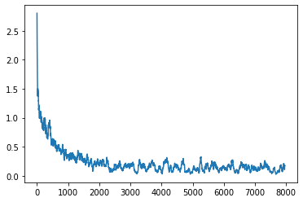

# Brain Tumor Classification through MRIs

Hung-An Chen (hungan)

Aditya Nayak (adityamn)

Muni Kumar Pridivi Vasu (mkpvasu)

Austin Sacro (ajsacro)

## Description

Brain tumors are one of the most serious illnesses which accounts for 85% to 90% of all primary central nervous system (CNS) tumors. During 2020 alone, it has affected nearly 300,000+ people worldwide according to statistics published by Cancer.net. It is also the 10th leading cause of death for men and women. Early detection and accurate understanding of the intricacies in types of the tumor which helps in curing, providing medication and prevention of the disease in future. The radiologists primarily use Magnetic Resonance Imaging (MRI) to analyze brain tumors. This provides an information about whether the brain is normal or abnormal and further aids in identifying the type of it. The advancements in machine learning and computer vision can give an valuable assistance to the doctors in swiftly and precisely determining the presence and type of tumor.

This motivated us take up to classify brain tumors through MRIs by training a neural network model through the [Brain Tumor Classification (MRI)](https://figshare.com/articles/dataset/brain_tumor_dataset/1512427?file=7953679) open source dataset as our project. There are three classifications we'll be working with: Glioma tumor / Meningioma tumor / Pituitary tumor. We'll be using the neural network introduced in lecture and applying different activation functions to test out their accuracies. We might try fitting in multiple layers to increase the overall accuracy and tuning parameters to prevent overfitting of the model. We'll mainly focus on training the model through the brain tumor images in the specified dataset.

## Dataset

The dataset used for our brain tumor classification model is published by Jun Chen. It contains 3064 T1-weighted contrast-inhanced MRI images of patients with three kinds of brain tumor: meningioma (708 slices), glioma (1426 slices), and pituitary tumor (930 slices).

This data is organized in matlab data format (.mat file). Each file stores a struct containing the following fields for an image:

- cjdata.label : 1 for meningioma, 2 for glioma, 3 for pituitary tumor
- cjdata.PID : patient ID
- cjdata.image : image data
- cjdata.tumorBorder : a vector storing the coordinates of discrete points on tumor border
- cjdata.tumorMask : a binary image with 1s indicating tumor region

## Approach


## Results
Initially, we ran ResNet with no momentum and weight decay, which resulted in the
network being overfitted to our training dataset. We got ~99% of training accuracy
yet the testing accuracy was merely ~91%. As a result, we ran the model several times
with distinct combinations of optimizer parameters, in an attempt to fine tune with
the best accuracy. It turned out that using `decay=0.01` and `momentum=0.1` gave
the optimal result with a training accuracy of 99.8% and a testing accuracy of 99.3%. Notice
that the overfitting issue has been significantly mitigated by introducing
weight decays.

The following graph shows the changes of convolutional losses as the training goes
on (The x-axis shows iterations).  We can clearly see that
the loss significantly dropped during the first epoch and fluctuated below 0.5 during
subsequent epochs.


## Discussion

Throughout this project, we ran into a few problems and obstacles along the way. We were initially running into some size and dimensional input problems using the resnet model, but then, we were getting some CUDA RuntineExceptions where we would run out of memory. If we were to keep working on the project in the future, one of the next steps we would take would be to train our model to learn a fourth classification, which would be no tumor. The dataset we used only had three classifications (Glicoma, Meningioma, and Pituitary), and initially we wanted to add this fourth classification of no tumor, but all of the datasets we found with no tumor were formatted and organized differently than the dataset we were already using. If we had more time, we would like to find a dataset for the no tumor classification and augment it to match our existing dataset.

```markdown
Syntax highlighted code block

# Header 1
## Header 2
### Header 3

- Bulleted
- List

1. Numbered
2. List

**Bold** and _Italic_ and `Code` text

[Link](url) and 
```

For more details see [Basic writing and formatting syntax](https://docs.github.com/en/github/writing-on-github/getting-started-with-writing-and-formatting-on-github/basic-writing-and-formatting-syntax).

### Jekyll Themes

Your Pages site will use the layout and styles from the Jekyll theme you have selected in your [repository settings](https://github.com/tzuan16/BrainTumorClassification/settings/pages). The name of this theme is saved in the Jekyll `_config.yml` configuration file.

### Support or Contact

Having trouble with Pages? Check out our [documentation](https://docs.github.com/categories/github-pages-basics/) or [contact support](https://support.github.com/contact) and we’ll help you sort it out.
